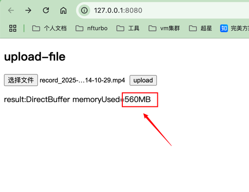
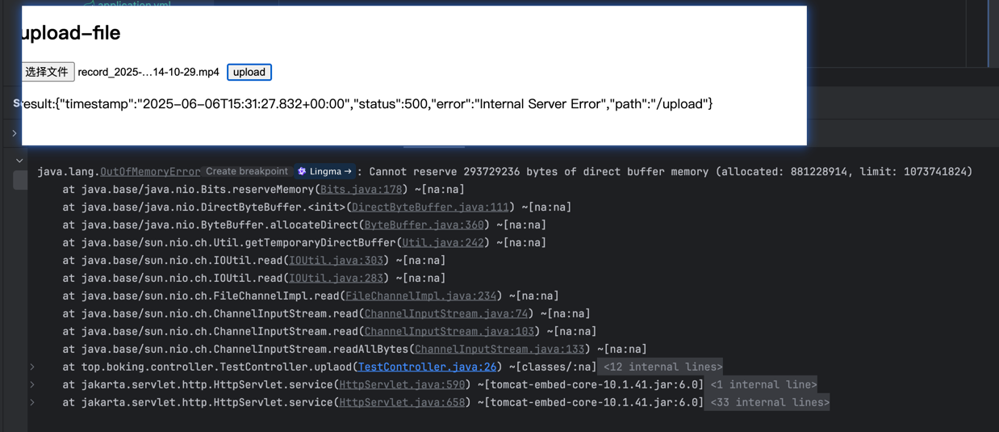

# Test Direct memory leak

> start this project,Accessing in browser  http://localhost:8080 and upload a file many times.When you have completed the file upload,you can see the memory usage,Just like the picture below

<br/>
upload file where call this method and trouble maker is `file.getInputStream()`
```java
@PostMapping("/upload")
    public String uplaod(@RequestPart("file") MultipartFile file) throws IOException {
        InputStream inputStream = file.getInputStream();
        // trouble maker
        byte[] bytes = file.getBytes();

        try {
            inputStream.readAllBytes();
        } finally {
            inputStream.close();
            System.gc();
        }
        BufferPoolMXBean directBufferPool = ManagementFactory
                .getPlatformMXBeans(BufferPoolMXBean.class)
                .stream()
                .filter(b -> b.getName().equals("direct"))
                .findFirst()
                .orElse(null);

        if (directBufferPool != null) {
            return String.format("DirectBuffer memoryUsed=%dMB%n",
                    directBufferPool.getMemoryUsed() / 1024 / 1024);
        }
        return "DirectBuffer: not found";
    }
```


> When the total size of the images you upload exceeds the direct memory capacity, OOM occurs,Just like the picture below



> To help you recurrent this error, when you start this test project,can add a jvm args
```
-XX:MaxDirectMemorySize=512m
```
